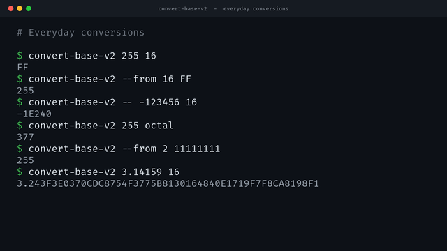
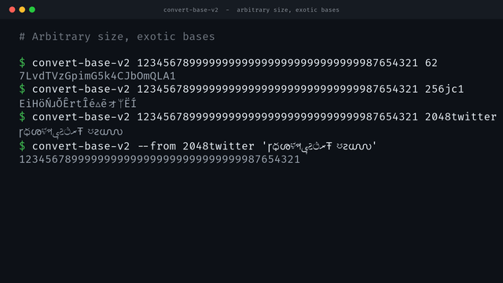
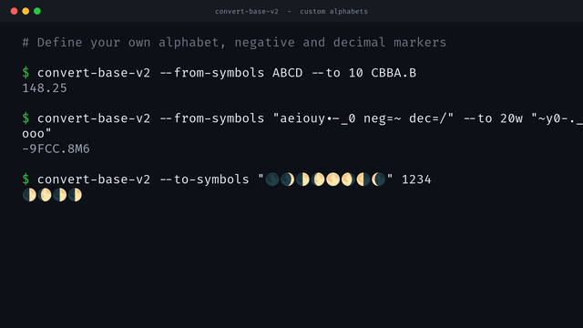
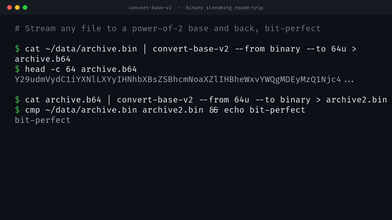
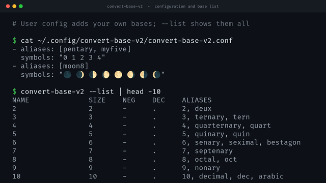

<!-- markdownlint-disable MD007 -- Unordered list indentation -->
<!-- markdownlint-disable MD010 -- No hard tabs -->
<!-- markdownlint-disable MD033 -- No inline html -->
<!-- markdownlint-disable MD055 -- Table pipe style [Expected: leading_and_trailing; Actual: leading_only; Missing trailing pipe] -->
<!-- markdownlint-disable MD041 -- First line in a file should be a top-level heading -->

<!--

-->

<!-- TOC ignore:true -->
# convert-base-v2

<table style="border: none; border-collapse: collapse;">
	<tr style="border: none; border-collapse: collapse;">
		<td style="border: none; border-collapse: collapse;"></td>
		<td style="border: none;">A cross-platform CLI program written in Go, to convert any number of any size, to and from any arbitrary base. Dozens of predefined named bases, or specify your own. And all the standards like base-10, 16, RFC base-64, etc. Supports negatives, floating-point, and piped binary data.</td>
	</tr style="border: none; border-collapse: collapse;">
</table>

<!--

>

<!-- TOC ignore:true -->
## Table of contents
<!-- TOC -->

- [Introduction](#introduction)
	- [Features](#features)
	- [Why convert a number to a large base](#why-convert-a-number-to-a-large-base)
- [Screenshots](#screenshots)
- [Status](#status)
- [Limitations](#limitations)
	- [Streaming binary conversion](#streaming-binary-conversion)
- [Example output](#example-output)
- [List of supported bases and their positional notation symbols](#list-of-supported-bases-and-their-positional-notation-symbols)
- [Supporting work](#supporting-work)
- [Document history](#document-history)
- [Copyright and license](#copyright-and-license)

<!-- /TOC -->

## Introduction

### Features

A universal cross-platform CLI number conversion program, written in Go, that:

- Converts any number of arbitrary size, to and from any arbitrary base.

- The number can be arbitrarily large.

- Supports negative and floating-point numbers in most bases. (Except a few that explicitly were not designed for that.) Even for bases designed only for binary-to-text encoding (RFC 4648 §4), can be used for positional notation - and thus negative and fractional numbers.

	- The program supports defining alternate symbols for "negative" and "decimal", if the regular ones clash with symbols already in the base.

- There are dozens of predefined named bases to specify as input or output.

- You can define your own arbitrary base and alphabet (the set of positional notation symbols), just by providing the alphabet.

	- E.g.: "`a 0 c X 🫪 だ`" is a perfectly valid, functional base-6 for some reason.

- Supports streaming encoding to and from binary input/output.

	- In other words, it can do what `basenc` can do, and also in O(N) linear time. (Which is unlike its regular base conversion operation, which necessarily works in O(N^2) quadratic time.)

	- But since this is first and foremost a _base converter_ and not an _encoder/decoder_, it's not as fast as `basenc`. The only benefit over `basenc` is that it can encode/decode to/from any arbitrary base that's a power of 2. `basenc` can "only" handle three bases (plus three variations).

- Accepts data from the command line, and/or from `stdin` (e.g. piped data).

### Why convert a number to a large base

There are myriad useful technical reasons, that would otherwise require chaining together a series of standard tools. Or, that would require using a web-based tool in a way that can't be scripted.

- As a trivial example, let's say you want to manually generate "serial numbers" now and then for physical, real-world use. You need, say, at most minute-level precision to insure uniqueness. But you need short, human-readable, unambiguous characters rather than a long date or number.

	You could use POSIX time (the number of seconds since 1970), divided by 60 for shorter minute-level precision, then convert that integer to Bitcoin's original base-58 "readable" scheme.

	As another example, "2026-01-01 @ 12:15 PM" could be represented as "1fLcL4" in standard base-64 RFC 4648 §5 `64u`, or "£±Яᛯ" in base-256 `256jc1`.

- The more obvious example is encoding binary data to text. Base 64 (`64r`, `64u`, `64jc1`) is the most effecient way to encode binary to UTF-8 text. But even higher bases are available for niche cases - e.g. base-2048 `2048twitter`, specifically designed by qntm for Twitter; or base-65536 `65536qntm` for optimal UTF-32 binary-to-text encoding.

At larger non-standard bases that this project created (e.g. `base-256jc1`), careful effort was made to:

- Avoid ambiguous characters that look like existing 0-9 A-Z ASCII characters and symbols.

- Avoid characters that are too wide and render poorly on fixed-width terminals.

- Avoid reserved characters across multiple operating systems and web standards, so that output can be used in those contexts. (Except for predefined standard base definitions that specify such characters, e.g. regular base-64.)

- Keep the character selection consistent across bases.

_Note: The command `convert-base-v2` has a version number on the end, to distinguish it from v1, which as predicted in that project, this v2 has a necessary minor break from in output, in one narrow edge case. And like v1, in the future there may be good reasons for the output to change again in a v3. For example, there are no "official standards" for large bases above 94 as of time of writing, but that could change. So to avoid overwriting an old script on a running system that may rely on it and it's predictable output, a new suffix number will be given to future programs if the output changes, and the two will coexist. That the existing version has a number, indicates that expected inevitability now._

## Screenshots

Click any image for the full-size version.

	
	
	
	
	

## Status

- [v1.0.0-rc4](https://github.com/jim-collier/convert-base-v2/releases/tag/v1.0.0-rc4) works great for almost everything, except for:

	- Streaming binary conversions: This is a rare edge use-case for a number-converter application, that you have to go out of your way to do and have a good reason. If the data is not aligned to the base, the program will intentionally error, to avoid dropping significant digits. (Previously it would just quietly drop significant digits.) A future update will pad with placeholders if not byte-aligned, so that any binary data, byte-aligned or not, can be converted.

	- Floating-point: Another rare edge use-case. For decimal places less than 50, the result will get stretched out to 50 places. Sometimes with inherent floating-point imprecision. There is no loss of data to the original value, there's just "hallucinated" precision that wasn't there before. Future versions will limit precision to what was given. Most uses of base converters are for integers.

		The data isn't "wrong", it just shows meaningless if not misleading "precision".

## Limitations

### Streaming binary conversion

Although support for streaming conversion of binary data was added in this compiled v2 release (vs no such thing in the scripted v1 release), "binary encoding/decoding" is not really something that is expected of base converters.

It was really a matter of a "why not" feature, while already adding support for piping input and output. (Which v1 also didn't have.)

But for day-to-day streaming binary conversion, `basenc` is at least 4x faster than this anyway, and has a much longer track-record.

Furthermore, base-64 - which `basenc` supports - is statistically the most compact way to store binary data as UTF-8 text. It might seem strange, but not even qntm's base-65536 (which this program has a named setting for) can beat the space density specifically for UTF-8 encoding. All modern OSes use UTF-8 by default. (For Twitter/𝕏, qntm's base-2048 allegedly optimally encodes binary data. Which this program also has a named setting for.)

The only good reason for using this program for streaming binary conversion, is for bases that no other program supports. (Such as aforementioned bases 2048, 65536 - as well as specialty byte-aligned bases such as the myriad variations of base 32 this supports. Or your own custom 2^N base positional notation symbol alphabet.) But until a future fix is put in place, it will gracefully error, if the input is not byte-aligned.

## Example output

The chart below shows a big random base 10 number '0000000000000001' in various bases.

<!--
Note that some of the larger bases appear to have longer output - but that's only due to being rendered with proportional fonts, combined with some of the wider Unicode characters. Look at the "Chars" column to see the actual # of characters in the output.

This is a partial list carried over from `convert-base-v1`. This new version has at least double just that are hard-coded.

|Base        | Chars | Number representation
|:--         | --:   | :--
|   2        |   101 | 11001100010001111010101010101001101101001000111010011010010010010001000110101111111100000000000000001
|   8        |    34 | 3142172525155107232222106577400001
|  10        |    31 | __2023090613425900000000000000001__
|  16        |    26 | 1988F5553691D3492235FE0001
|  26        |    22 | DXNNAGDDUWPNKQIDYGEAMJ
|  32[r]     |    21 | BTCHVKU3JDU2JEI274AAB
|  32h       |    21 | 1J27LAKR93KQ948QVS001
|  32c       |    21 | 1K27NAMV93MT948TZW001
|  32w       |    21 | 3X49fGcqF5cpF6Cpxr223
|  36        |    20 | 5G53VAIZAJBZ2D5Y2Y9T
|  48jc1     |    19 | 153ᚼᛦ🜥⁑h҂▵ᛦ🜿▿▸▿2q🜥q
|  52        |    18 | NftxKBqjrhTdQKHAGJ
|  62        |    17 | gR7BplOIkweh9aKht
|  64[r]     |    17 | PYFLLDf7JII8r/W01
|  64u       |    17 | PYFLLDf7JII8r_W01
|  64jc1u    |    17 | PYFLLDf7JII8rʞW01
|  64jc1ws   |    17 | hλMXXHᛝ7VRR8▸≠w01
|  94[ascii] |    16 | %+(A}'O^UwzN_{sS
| 128jc1     |    15 | 6🜥Mᛦ⍩ÑQŵʬμʞᚼä01
| 256jc1     |    13 | Pĵㅍ‡sĨǍᚧYrぇ01
| 288jc1     |    13 | 6zф⅖ẄÃЋゲㅎぇúkᛎ
-->

## List of supported bases and their positional notation symbols

Any number of any size can be converted to and from any of these bases. Most support negative numbers and decimals, if the intention makes sense.

(_About missing the base symbol alphabets: they exist in the program, just not in this doc yet._)

| Base  | Name [arg]           | Aliases                                               | Description                      | Specification | Symbol alphabet [or at least first and last 64 tokens]
| --:   | :--                  | :--                                                   | :--                             | :--           | :---
| 2     | 2                    | binary, bike                                          | Text ones and zeros              |               | 01
| 3     | 3                    | ternary, trike                                        | Rarely used in computers         |               | 012
| 4     | 4                    | quaternary, quad                                     |                                  |               | 0123
| 5     | 5                    | quinary, stuiver                                      |                                  |               | 01234
| 6     | 6                    | senary, seximal, bestagon                             |                                  |               | 012345
| 7     | 7                    | septenary                                             |                                  |               | 0123456
| 8     | 8                    | octal, oct, octopus                                   | Older base for programming       |               | 01234567
| 9     | 9                    | nonary, non                                           |                                  |               | 012345678
| 10    | 10                   | decimal, dec, arabic, dime                            |                                  |               | 0123456789
| 10    | kanji                | 10kanji, japan, nippon, 日本                           |                                 |                | 〇一二三四五六七八九
| 10    | hanzi                | 10hanzi, china, zhōngguó, 中国                         |                                 |                | 零一二三四五六七八九
| 10    | hindi                | 10hindi, india, hārat, भारत                            |                                  |               | ०१२३४५६७८९
| 10    | arabicindic          | 10arabicindic, 10easternarabic, easternarabic         |                                  |               | ٠١٢٣٤٥٦٧٨٩
| 10    | rods                 | 10rods                                                |                                  |               | 〇𝍠𝍡𝍢𝍣𝍤𝍥𝍦𝍧𝍨
| 12    | 12                   | 12hex, 12h, dozenal, duodecimal                       |                                  |               | 0123456789AB
| 16    | 16                   | 16hex, 16h, hex, hexadecimal, nerdnumber, onepounder  |                                  |               | 0123456789ABCDEF
| 20    | 20                   | 20hex, 20h, vigesimal, venti                          |                                  |               | 0123456789ABCDEFGHIJ
| 20    | 20wordsafe           | 20ws, 20w, 20google, 20g, 20nofks                     |                                  |               | 23456789CFGHJMPQRVWX
| 20    | mayan                | 20maya                                                |                                  |               | 𝋠𝋡𝋢𝋣𝋤𝋥𝋦𝋧𝋨𝋩𝋪𝋫𝋬𝋭𝋮𝋯𝋰𝋱𝋲𝋳
| 24    | 24                   | 24hex, 24h                                            |                                  |               | 0123456789ABCDEFGHIJKLMN
| 26    | 26                   | alphabet                                              |                                  |               | ABCDEFGHIJKLMNOPQRSTUVWXYZ
| 30    | 30rock               | 30hex, 30h, 30                                        |                                  |               | 0123456789ABCDEFGHIJKLMNOPQRST
| 32    | 32                   | 32hex, 32h, triacontakaidecimal, theonetrue32         |                                  |               | 0123456789ABCDEFGHIJKLMNOPQRSTUV
| 32    | 32rfc                | 32r                                                   |                                  |               | ABCDEFGHIJKLMNOPQRSTUVWXYZ234567
| 32    | crockford            | 32crockford, 32crock, 32c                             |                                  |               | 0123456789ABCDEFGHJKMNPQRSTVWXYZ
| 32    | 32wordsafe           | 32ws, 32w, 32google, 32g, 32nofks                     |                                  |               | 23456789CFGHJMPQRVWXcfghjmpqrvwx
| 32    | zbase32              | 32zbase, 32z                                          |                                  |               | ybndrfg8ejkmcpqxot1uwisza345h769
| 32    | 32bip                | 32bitcoin, 32btc, 32segwit, bech32, bech32m           |                                  |               | qpzry9x8gf2tvdw0s3jn54khce6mua7l
| 36    | 36                   | 36hex, 36h                                            |                                  |               | 0123456789ABCDEFGHIJKLMNOPQRSTUVWXYZ
| 38    | hostname             | 38hostname, 38jc                                      |                                  |               | 0123456789abcdefghijklmnopqrstuvwxyz-.
| 39    | username             | 39username, 39jc                                      |                                  |               | 0123456789abcdefghijklmnopqrstuvwxyz-_.
| 42    | 42                   | 42hex, 42h                                            |                                  |               | 0123456789ABCDEFGHIJKLMNOPQRSTUVWXYZabcdef
| 45    | 45rfc9285            | 45r                                                   | RFC 9285, space is a symbol
| 45    | email                | 45email, 45jc                                         |                                  |               | 0123456789abcdefghijklmnopqrstuvwxyz-_%+.:@[]
| 48    | 48                   | 48hex, 48h                                            |                                  |               | 0123456789ABCDEFGHIJKLMNOPQRSTUVWXYZabcdefghijkl
| 48    | 48wordsafe           | 48w, 48ws, 48jcws, 48nofks                            |                                  |               | 23456789CFGHJMPQRVWXcfghjmpqrvwxʞλμᛎᛏᛘᛯᛝᛦᛨᚠᚧᚬᚼ🜣
| 48    | 48v1compat           | 48j1                                                  |                                  |               | 0123456789CFGHJMPQRVWXcfghjmpqrvwxʞλμᛎᛏᛘᛯᛝᛦᛨᚠᚧᚬ
| 52    | 52                   | upperlower                                            |                                  |               | ABCDEFGHIJKLMNOPQRSTUVWXYZabcdefghijklmnopqrstuvwxyz
| 58    | 58bitcoin            | 58btc                                                 |                                  |               | 123456789ABCDEFGHJKLMNPQRSTUVWXYZabcdefghijkmnopqrstuvwxyz
| 60    | 60jc                 | sexagesimal, hexagesimal                              |                                  |               | 0123456789ABCDEFGHIJKLMNOPQRSTUVWXYabcdefghijklmnopqrstuvwxy
| 60    | 60tc                 | newbase60                                             |                                  |               | 0123456789ABCDEFGHJKLMNPQRSTUVWXYZ_abcdefghijkmnopqrstuvwxyz
| 62    | 62                   | 62hex, 62h                                            |                                  |               | 0123456789ABCDEFGHIJKLMNOPQRSTUVWXYZabcdefghijklmnopqrstuvwxyz
| 64    | 64hex                | 64hexurl, 64hexu, 64hu                                | Tightest binary-to-text encoding for UTF-8 (Linux, macOS, Windows). | | 0123456789ABCDEFGHIJKLMNOPQRSTUVWXYZabcdefghijklmnopqrstuvwxyz-_
| 64    | 64jc                 | 64p, 64j1u                                            | Almost tightest binary-to-text encoding for UTF-8.                  | | 0123456789ABCDEFGHIJKLMNOPQRSTUVWXYZabcdefghijklmnopqrstuvwxyzʞλ
| 64    | 64rfc                | 64r                                                   | Tied for tightest binary-to-text encoding for UTF-8.                         | | ABCDEFGHIJKLMNOPQRSTUVWXYZabcdefghijklmnopqrstuvwxyz0123456789+/
| 64    | 64rfcurl             | 64rfcu, 64ru                                          |                                  |               | ABCDEFGHIJKLMNOPQRSTUVWXYZabcdefghijklmnopqrstuvwxyz0123456789-_
| 64    | 64wordsafe           | 64ws, 64w, 64jcws, 64nofks                            |                                  |               | 23456789CFGHJMPQRVWXcfghjmpqrvwxʞλμᛎᛏᛘᛯᛝᛦᛨᚠᚧᚬᚼ🜣🜥🜿🝅▵▸▿◂҂‡±⁑÷∞≈≠ΩƱ
| 64    | 64v1compat           | 64j1uw                                                |                                  |               | 0123456789CFGHJMPQRVWXcfghjmpqrvwxʞλμᛎᛏᛘᛯᛝᛦᛨᚠᚧᚬᚼ🜣🜥🜿🝅▵▸▿◂҂‡±⁑÷∞≈≠
| 64    | 64emoji              | emoji, 64e                                            | All-emoji alphabet; also encodes binary. |     | ⌚☔☕⚽⛄✅✨❌❓⭐🌈🌙🌵🌷🍄🍇🍉🍌🍎🍔🍕🍦🍰🍷🍺🎁🎈🎉🎓🎨🎯🎸🏆🐌🐍🐘🐙🐟🐢🐧🐸🐼👀👑👻👽💀💎💡💣💰📌📷🔑🔔🔥🔨🔭😀😍😭😴🚀🚲
| 69    | 69pshihn             |                                                       |                                  |               | ABCDEFGHIJKLMNOPQRSTUVWXYZabcdefghijklmnopqrstuvwxyz0123456789+/-*<>\|
| 85    | z85                  | 85z, 85zeromq                                         |                                  |               | 0123456789abcdefghijklmnopqrstuvwxyzABCDEFGHIJKLMNOPQRSTUVWXYZ.-:+=^!/*?&<>()[]{}@%$#
| 85    | postscript           | 85adobe, 85postscript, 85ps                           |                                  |               | !"#$%&'()*+,-./0123456789:;<=>?@ABCDEFGHIJKLMNOPQRSTUVWXYZ[\]^_\`abcdefghijklmnopqrstu
| 85    | 85ipv6               | 85rfc1924, 85aprilfools, 85fools, 85elz               |                                  |               | 0123456789ABCDEFGHIJKLMNOPQRSTUVWXYZabcdefghijklmnopqrstuvwxyz!#$%&()*+-;<=>?@^_\`{\|}~
| 91    | 91hk                 | 91bas                                                 |                                  |               | ABCDEFGHIJKLMNOPQRSTUVWXYZabcdefghijklmnopqrstuvwxyz0123456789!#$%&()*+,./:;<=>?@[]^_\`{\|}~"
| 98    | keyboard             | 98, text, ascii, kbd                                  | Any plain-text document is valid input as-is. |      | (95 printable ASCII 0x20-0x7E, plus tab, newline, return)
| 128   | 128jc                | 128p                                                  |                                  |               | 0123456789ABCDEFGHIJKLMNOPQRSTUVWXYZabcdefghijklmnopqrstuvwxyzʞλμᛎᛏᛘᛯᛝᛦᛨᚠᚧᚬᚼ🜣🜥🜿🝅▵▸▿◂҂‡±⁑÷∞≈≠ΩƱΞψϠδϟЋЖЯѢф¢£¥§¿ɤʬ⍤⍩⌲⍋⍒⍢ÂĈÊĜĤÎĴÔŜÛŴ
| 128   | 128v1compat          | 128j1                                                 |                                  |               | 0123456789CFGHJMPQRVWXcfghjmpqrvwxʞλμᛎᛏᛘᛯᛝᛦᛨᚠᚧᚬᚼ🜣🜥🜿🝅▵▸▿◂҂‡±⁑÷∞≈≠ΩƱΞψϠδϟЋЖЯѢф¢£¥§¿ɤʬ⍤⍩⌲⍋⍒⍢ÂĈÊĜĤĴŜŴŶâĉêĝĥĵŝŵŷÃẼÑỸãẽñỹÄËẄẌŸäëẅẍÿÁĆÉ
| 256   | 256jc                | 256p, 256j1                                           |                                  |               | 0123456789ABCDEFGHIJKLMNOPQRSTUVWXYZabcdefghijklmnopqrstuvwxyzʞλ ...to... óŕśúẃýźĀĒĪŌŪȲāēīōūȳǍČĎĚǦȞǨŇǑŘŠǓǎčďěǧȟǩňǒřšǔǝɹʇʌ₸᛬웃유ㅈㅊㅍㅎㅱㅸㅠソッゞぅぇォ
| 256   | binary               | bin, bytes, raw                                       |                                  |               | (256 raw bytes, 0x00–0xFF)
| 288   | 288jc                | 288p, 288j1                                           |                                  |               | 0123456789ABCDEFGHIJKLMNOPQRSTUVWXYZabcdefghijklmnopqrstuvwxyzʞλ ...to... čďěǧȟǩňǒřšǔǝɹʇʌ₸᛬웃유ㅈㅊㅍㅎㅱㅸㅠソッゞぅぇォゲサじすスせちづでネビべぺまモゟヲ½⅓⅔¼¾⅕⅖⅗⅘⅙⅚⅛⅜⅝⅞
| 2048  | 2048twitter          | 2048x, 2048qntm                                       |                                  |               | 89ABCDEFGHIJKLMNOPQRSTUVWXYZabcdefghijklmnopqrstuvwxyzÆÐØÞßæðøþĐ ...to... ྈྉྊྋྌကခဂဃငစဆဇဈဉညဋဌဍဎဏတထဒဓနပဖဗဘမယရလဝသဟဠအဢဣဤဥဧဨဩဪဿ၀၁၂၃၄၅၆၇၈၉ၐၑၒၓၔၕ
| 2048  | 2048rust             | 2048llfourn                                           | Tightest binary-to-text encoding for Twitter. |               | صºÀÁÂÃÄÅÆÇÈÉÊËÌÍÎÏÐÑÒÓÔÕÖÙÚÛÜÝÞßàáâãäåæçèéêëìíîïðñòóôõöøùúûüýþÿ ...to... ႫႬႭႮႯႰႱႲႳႴႵႶႷႸႹႺႻႼႽႾႿჀჁჂჃჄჅაბგდევზთიკლმნოპჟრსტუფქღყშჩცძწჭხჯჰჱჲჳ྾
| 32768 | 32768qntm            | 32768utf16                                            | Tightest binary-to-text encoding for UTF-16.  |               | ҠҡҢңҤҥҦҧҨҩҪҫҬҭҮүҰұҲҳҴҵҶҷҸҹҺһҼҽҾҿԀԁԂԃԄԅԆԇԈԉԊԋԌԍԎԏԐԑԒԓԔԕԖԗԘԙԚԛԜԝԞԟ ...to... ꞀꞁꞂꞃꞄꞅꞆꞇꞈ꞉꞊ꞋꞌꞍꞎꞏꞐꞑꞒꞓꞔꞕꞖꞗꞘꞙꞚꞛꞜꞝꞞꞟꡀꡁꡂꡃꡄꡅꡆꡇꡈꡉꡊꡋꡌꡍꡎꡏꡐꡑꡒꡓꡔꡕꡖꡗꡘꡙꡚꡛꡜꡝꡞꡟ
| 65536 | 65536                | 65536qntm, 65536utf32                                 | Tightest binary-to-text encoding for UTF-32.  |               | 㐀㐁㐂㐃㐄㐅㐆㐇㐈㐉㐊㐋㐌㐍㐎㐏㐐㐑㐒㐓㐔㐕㐖㐗㐘㐙㐚㐛㐜㐝㐞㐟㐠㐡㐢㐣㐤㐥㐦㐧㐨㐩㐪㐫㐬㐭㐮㐯㐰㐱㐲㐳㐴㐵㐶㐷㐸㐹㐺㐻㐼㐽㐾㐿 ...to... 𨗀𨗁𨗂𨗃𨗄𨗅𨗆𨗇𨗈𨗉𨗊𨗋𨗌𨗍𨗎𨗏𨗐𨗑𨗒𨗓𨗔𨗕𨗖𨗗𨗘𨗙𨗚𨗛𨗜𨗝𨗞𨗟𨗠𨗡𨗢𨗣𨗤𨗥𨗦𨗧𨗨𨗩𨗪𨗫𨗬𨗭𨗮𨗯𨗰𨗱𨗲𨗳𨗴𨗵𨗶𨗷𨗸𨗹𨗺𨗻𨗼𨗽𨗾𨗿

## Supporting work

Note: The following are directory listings that typically contain a raw `.csv` file, the same data in a better-formatted Gnumeric spreadsheet, and an Excel version.

LibreOffice would have been much preferred to [Gnumeric](https://download.cnet.com/gnumeric/) (both are multi-platform open-source spreadsheets), except that for these large spreadsheets covering most or all Unicode, LibreOffice chokes too hard to use. (Even on 32 cores and 128GB RAM in 2026.) Gnumeric handles it with ease, seemingly even better than Excel.

Also, font rendering for Unicode look significantly smoother on Linux (with B&W font-smoothing with no hinting), than Excel for Windows. (Though to be fair, my version of Excel is older and still uses ClearType, with RGB subpixel hinting and overly-strong hinting.) MacOS should look great too.

Unicode listings:

- [All printable Unicode characters, ordered by block](https://github.com/jim-collier/convert-base-v2/tree/main/reference/unicode_all_grouped_by_block).

- [Nicely AI-ordered lists of printable Unicode characters <= U+1FBF9](https://github.com/jim-collier/convert-base-v2/tree/main/reference/unicode_ordered_below_U1FBF9) (i.e. directly printable in most modern fonts).

	Characters are, in many cases at higher code points, re-ordered to look nice and "expected" in a positional notation numbering system. (I.e. numbered balls grouped by type and go in order, arrows grouped by style and rotate from "north" to "northwest".

	This is a great reference to start from, for designing a large base.

## Document history

- 2026-05-03:
	- Fixed incorrect lifecycle and status badges.
	- Minor corrections.
- 2026-04-22: Added list of unicode characters used.
- 2026-04-17: First version.

## Copyright and license

> Copyright © 2026 Jim Collier (ID: 1cv◂‡Vᛦ) 
> Licensed under GNU GPL v2 <https://www.gnu.org/licenses/gpl-2.0.html>. No warranty.
