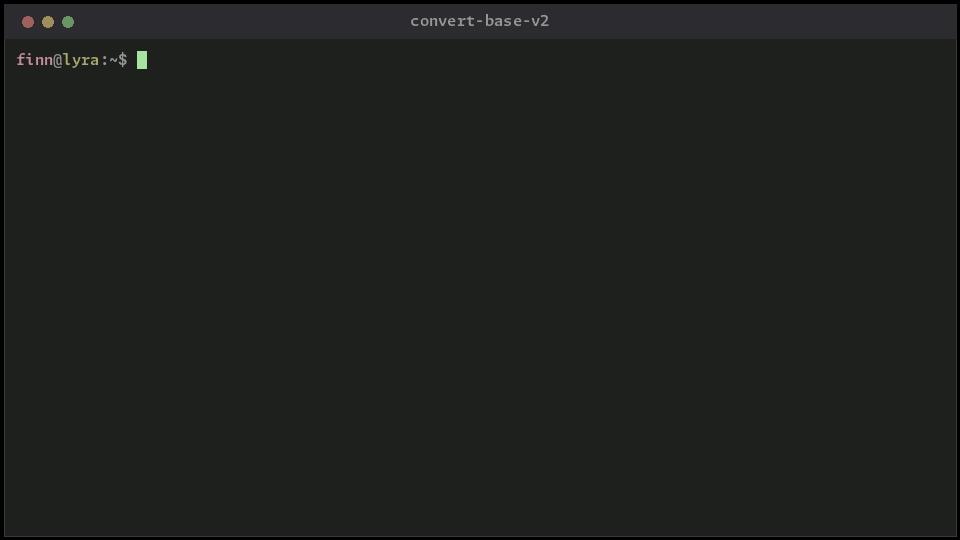

<!-- markdownlint-disable MD007 -- Unordered list indentation -->
<!-- markdownlint-disable MD010 -- No hard tabs -->
<!-- markdownlint-disable MD033 -- No inline html -->
<!-- markdownlint-disable MD055 -- Table pipe style [Expected: leading_and_trailing; Actual: leading_only; Missing trailing pipe] -->
<!-- markdownlint-disable MD041 -- First line in a file should be a top-level heading -->
<div align="center">


<!-- TOC ignore:true -->
# convert-base-v2

<!--
<table style="border: none; border-collapse: collapse;">
	<tr style="border: none; border-collapse: collapse;">
		<td style="border: none; border-collapse: collapse;"></td>
		<td style="border: none;"><b>Convert any positional notation number, of any size, to and from any numeric base</b><br /><br />Also, encode/decode binary-to-text across far more bases than the standard tools like `base64` give you.</td>
	</tr>
</table>
-->



<table>
	<tr>
		<td>Convert any regular positional notation number, of any size - positive, negative, and/or decimal - to and from any numeric base.</td>
		<td>Encode/decode streaming binary-to-text across far more bases than the standard tools like <code>base64</code> give you, and on average faster.</td>
		<td>A single, fast, cross-platform static binary. The same conversion core is also an Apache-licensed Go package and a WebAssembly module, so you can build it into your own program or web page.</td>
	</tr>
</table>

</div>

<!--


Convert any positional notation number, of any size, to and from any numeric base.

Encode/decode streaming binary-to-text across far more bases than the standard tools like `base64` give you, and on average faster.

It's a single, fast, cross-platform static binary written in Go.
-->

<!-- TOC ignore:true -->
## Table of contents
<!-- TOC -->

- [Features](#features)
- [Try it from here](#try-it-from-here)
- [Install](#install)
	- [Packages and installers](#packages-and-installers)
	- [One-line install script](#one-line-install-script)
	- [Build it yourself](#build-it-yourself)
- [Usage](#usage)
- [Configuration](#configuration)
- [Use it in your own code](#use-it-in-your-own-code)
	- [A Go package](#a-go-package)
	- [WebAssembly, in a browser](#webassembly-in-a-browser)
	- [WebAssembly, anywhere else](#webassembly-anywhere-else)
	- [WebAssembly, as a function call](#webassembly-as-a-function-call)
	- [Or just run it](#or-just-run-it)
	- [Licensing](#licensing)
- [Why convert a number to a large base](#why-convert-a-number-to-a-large-base)
	- [Also why the -v2?](#also-why-the--v2)
- [Speed](#speed)
- [Third-party binary codecs, built in](#third-party-binary-codecs-built-in)
- [List of predefined bases](#list-of-predefined-bases)
- [How to design a numeric base](#how-to-design-a-numeric-base)
- [Set up a development environment](#set-up-a-development-environment)
- [Support convert-base-v2](#support-convert-base-v2)
- [Legal stuff](#legal-stuff)

<!-- /TOC -->

## Features

- **Any number, any base**: Convert a value of any size to or from any base. All the usual standards are built in (base 10, 16, RFC 4648 base 32 and 64, and more), plus more than sixty predefined named bases.

- **Bring your own alphabet**: Define a base on the spot by listing its symbols. For example, "`a 0 c X 🫪 だ`" is a perfectly good base 6.

- **Negatives and fractions**: Both work in nearly every base. Even bases meant only for binary encoding can be pressed into positional use. If the usual `-` and `.` markers clash with a base's own symbols, you can set your own.

- **Binary to text, in many more bases than usual**: Encode or decode raw binary in every power-of-two base (2 through 256, plus 2048, 32768, and 65536) and the standard chunked codecs base45, Ascii85, Z85, and base91. That covers everything `basenc` does, at comparable speed, plus bases `basenc` never heard of. Bases with no byte-exact mapping are refused in binary mode, and `--list` shows which ones qualify.

	- To re-encode straight between two text bases as bytes (hex to base 64, say), add `--binary`. Without it, two power-of-two text bases convert as a plain number, which drops leading zeros; a note on stderr points this out, and `--number` silences it.

- **Reads from anywhere**: Takes input from the command line or from `stdin`, so it drops into a pipe.

- **One portable binary**: Cross-platform Go, no runtime or dependencies to install.

## Try it from here

**[Open the converter in your browser](https://jim-collier.github.io/convert-base-v2/)**. Nothing to install, nothing to sign up for.

It runs the real conversion core, compiled to WebAssembly, inside your own browser tab. Every base listed below works, including the large Unicode ones.

*Note: Nothing you type is sent anywhere. Your browser downloads the page and the WASM module once, then does all the work locally - disconnect from the network and it keeps converting. And no cookies, beacons, tracking, fingerprinting, analytics, or captchas that have you wondering if you are really a human.*

## Install

### Packages and installers

Grab a build for your platform from the [Releases page](https://github.com/jim-collier/convert-base-v2/releases). Every option installs the same single static executable.

- **Linux**: a `.deb` or `.rpm` (amd64 or arm64), or a `.tgz` tarball.

- **Windows**: a one-click installer `.exe` that adds the tool to your PATH, or a plain `.zip`.

- **macOS and FreeBSD**: a `.tgz` tarball.

Each release includes a `checksums.txt` so you can verify what you downloaded.

### One-line install script

For Linux, macOS, FreeBSD, and WSL. The script prints what it will do, verifies the download against the release's checksum file, and asks before touching anything.

~~~bash
bash <(curl -fsSL https://raw.githubusercontent.com/jim-collier/convert-base-v2/main/install.bash)
~~~

- `--release stable|dev` picks the channel. Default is stable.

- `--target user|system` picks the location. A user install goes to `~/.local/bin/`, a system install to `/usr/local/bin/`.

- `--arch x86_64|arm64` overrides the detected architecture.

- `-y` skips the confirmation prompt.

On Windows, use the installer `.exe` instead.

### Build it yourself

You need Go 1.21 or newer, and nothing else. There are no dependencies to fetch.

~~~bash
git clone https://github.com/jim-collier/convert-base-v2
cd convert-base-v2/lib
make local        # builds ./convert-base-v2
~~~

Copy the resulting binary anywhere on your PATH. For the full set of build targets, see [Set up a development environment](#set-up-a-development-environment).

## Usage

~~~bash
# Hex to decimal
convert-base-v2 --from hex FF                 # 255

# Decimal to hex-style base 64
convert-base-v2 1767269700 64hex                # 1fLcL4

# Decimal to a base you invent on the spot
convert-base-v2 --to-symbols "a b c d e f" 42 # bba

# Pick your own negative or decimal marker, on any base
convert-base-v2 --from hex --from-neg '~' -- '~ff'  # -255

# Encode a file to base 64, and back
some-command | convert-base-v2 --binary --to 64
convert-base-v2 --binary --from 64 --to bytes < file.b64

# Text in, text out: 98keyboard holds every character a text file normally does
printf 'hi\nthere' | convert-base-v2 --from keyboard --to 10 -   # 3772491441706426

# Its tab, newline and return digits can also be written by name
convert-base-v2 --from keyboard --to 10 -n 'hi⊳LFthere'          # the same number
convert-base-v2 --from 10 --to keyboard --escape-controls -n 3772491441706426

# See every base, or one base's alphabet
convert-base-v2 --list
convert-base-v2 --show-symbols 64emoji
~~~

A base can hold control characters as digits, which are impossible to type at a prompt and invisible on a terminal. Those can be written by name instead, as `⊳LF`, `⊳TAB`, `⊳CR` and so on. Input takes the named and the raw forms mixed, always; output writes them only when `--escape-controls` asks for it. The marker is a character no such base uses, so nothing ever needs escaping twice.

Run `convert-base-v2 --help` for the full flag list, or `--examples` for more.

To avoid confusion when working with binary data, you can add these aliases to your shell startup script:

~~~bash
## Streaming binary/text codec
alias convert-base-v2-bin="convert-base-v2 --binary"

## Positional notation base conversion
alias convert-base-v2-num="convert-base-v2 --number"
~~~

## Configuration

The first run writes `~/.config/convert-base-v2/convert-base-v2.shcl`, a commented file for defining bases of your own. Nothing rewrites it after that. A system-wide `/etc/convert-base-v2/convert-base-v2.shcl` is read first, so the user file wins over it, and both win over the built-in bases: reuse a built-in name and your definition replaces it.

A base is a name and its digits, plus whatever markers it needs.

~~~text
base: 10emoji
	aliases: emoji10
	symbols: "😀 😑 😔 😘 😜 😠 😬 😮 🙄 🤔"
	negative: "🥕"
	decimal: "⚽"
~~~

That base is in the file as a working example to copy from. The format is [SHCL](https://github.com/jim-collier/shcl), and the file itself documents every field.

## Use it in your own code

The conversion core is a library in its own right, and the command is a thin layer on top of it. Everything below runs that same code, so none of them can disagree with the command about what a base means.

Five separate things get built here, and they are not interchangeable:

- **The command**, `convert-base-v2`. A program. It parses flags, loads config files, and moves data through pipes.

- **The Go package**, `lib/convertbase`. A library. Import it and call its functions.

- **The browser module**, `web/convert-base.wasm`. The package compiled for a web page, with a small set of JavaScript calls.

- **The WASI module**, `dist/convert-base-v2.wasm`. The whole command compiled to WebAssembly. A program, not a library.

- **The reactor module**, `dist/convert-base-reactor.wasm`. The package compiled for any WebAssembly runtime, exporting plain functions.

The line between the command and the package is about what each one is allowed to do. Writing a config file into someone's home directory is fine for a program that person chose to run. It is not fine for a library that got imported into somebody else's project, so the package does none of it. It touches no files, reads no environment variables, and prints nothing. The caller decides all of that.

### A Go package

```sh
go get github.com/jim-collier/convert-base-v2/lib/convertbase
```

```go
reg, _ := convertbase.NewRegistry()
from, _ := convertbase.ResolveBase(reg, "10", "", nil)
to, _ := convertbase.ResolveBase(reg, "62", "", nil)

out, err := convertbase.Convert("86434491232548995369", from, to, -1)
```

Convert whole values, or stream through an `io.Reader` and `io.Writer` in constant memory for anything large. Define your own alphabets, override the negative and decimal markers, and read the base registry directly.

The package version moves on its own, separately from the command's. It is at v0 for now, which means the shape of the API may still change.

The first package tag has not been pushed yet, so `go get` cannot resolve it until it exists. Building against a local clone of the repository works today.

### WebAssembly, in a browser

The [demo page](https://jim-collier.github.io/convert-base-v2/) is the whole library compiled to WebAssembly, with a small set of JavaScript calls:

```js
const res = convertBase.convert({value: "255", from: "10", to: "16"});
// { ok: true, value: "FF" }
```

Serve the two files next to your page and it works offline, on static hosting, with no backend.

This build talks to JavaScript through the browser, so a page is the only place it runs. It is not a general WebAssembly library.

### WebAssembly, anywhere else

The command also builds as a WASI module, which runs under Wasmtime, Wazero, Node, and the WebAssembly edge platforms. WASI hands it real argv, standard input, and standard output, so streaming works exactly as it does natively, and one file runs on every architecture.

```sh
wasmtime run dist/convert-base-v2.wasm -- --from hex --to 10 ff
# 255
```

This is the command in a sandbox, not the library made portable. A Rust, Python, or C# program reaches it by starting it under a runtime and wiring up argv and pipes. That is running a program in process. It is not calling a function, and the module does not survive being run a second time in the same instance.

That is still enough to cover callers in any language with a WebAssembly runtime, with no C interface to freeze and no per-platform build to ship. What it does not give you is conversion as a plain function call. That is what the reactor module is for.

### WebAssembly, as a function call

The reactor module is the library compiled for any WebAssembly runtime, exporting plain functions the host calls directly: one-shot conversion, base lookup, the radix and padding symbol of a base, symbol counting, and a stable numeric error code set with readable error text. Strings cross as a pointer and length through the module's memory, with an exported allocator pair; the full contract is in [`lib/reactor/README.md`](lib/reactor/README.md). Build it with `make reactor` (needs a Go 1.24 or newer toolchain).

Streaming is there too, as a push API: open a stream, write raw bytes as they arrive, read output chunks back, finish. It runs the same constant-memory paths the command uses for piped data. The WASI module above remains the simpler choice when all you want is a pipe.

### Or just run it

If you can start a process, that is still the simplest option, and always has been. Input and output are pipes, so a conversion of any size streams through in constant memory whatever language you call it from. The library and the WebAssembly builds are for the cases where you cannot shell out.

### Licensing

Which license applies follows the same split.

- The Go package, the browser module, and the reactor module are Apache-2.0. Build them into anything, commercial and closed-source work included. Keep the credit with them and you are done.

- The command stays GPL-2.0-or-later, and so does the WASI module, because that module is the command.

## Why convert a number to a large base

Plenty of everyday tasks are easier in a bigger base, and they usually mean chaining several tools together or reaching for a web page that can't be scripted.

- **Short, readable IDs**: Say you want to hand-generate serial numbers now and then, unique to the minute, but short and unambiguous rather than a long date or number. Take POSIX time (seconds since 1970), optionally divide by 60 for minute precision, and convert it to a compact base. The value for "2026-01-01 12:15 PM" (1767269700) is `1fLcL4` in hex-style base 64 (`64hex`), or `ɷƨɞ«` in base 256 (`256tt`).

- **Compact binary as text**: Base 64 (`64rfc`, `64url`, `64code`) is the tightest way to pack binary into UTF-8 text. Higher bases help in niche cases: `2048qntm`, qntm's base built for Twitter posts, or `65536qntm` for UTF-32.

The larger custom bases here (like `256tt`) were designed with care to:

- Avoid characters that look like an existing 0-9 or A-Z.

- Avoid characters too wide to render cleanly in a fixed-width terminal.

- Avoid characters reserved by operating systems and web standards, so the output stays usable in those places. (The published standards, like base 64, keep their own reserved characters.)

- Stay consistent from one base to the next.

### Also why the -v2?

The `-v2` marks this as the successor to the original v1.

As v1 anticipated, v2 changes its output in one narrow edge case, and a future version may change it again. There are no official standards for bases above 94 yet. If one ever appears and collides with a name used here, a new suffix keeps the old and new tools installed side by side, so a script that relies on today's exact, deterministic output never breaks. That is what lets `-v2` sit alongside `-v1` and `-v1b`, and leaves room for a `-v3` later.

That compatibility is tested, not assumed. The original `convert-base-v1` and `convert-base-v1b` scripts are bundled in the repo, and every test run executes them and compares their output byte for byte against the compatibility bases here (`--list-compat` shows those).

## Speed

`convert-base-v2` is fast enough to sit in a pipe next to the coreutils tools without being the bottleneck.

Binary and text stream encoding is the part that benchmarks cleanly, so here is measured throughput against the standard tools, one table per format. It decodes faster than the standard tools, and encodes in the same ballpark.

**Base-64**

| Program | text -> binary | binary -> text |
| :-- | --: | --: |
| `convert-base-v2` | **744** | 755 |
| coreutils `base64` | 323 | 1,056 |
| coreutils `basenc` | 323 | 1,048 |
| openssl `base64` | 276 | **1,221** |

**Base-32**

| Program | text -> binary | binary -> text |
| :-- | --: | --: |
| `convert-base-v2` | **596** | 716 |
| coreutils `base32` | 400 | **855** |
| coreutils `basenc` | 376 | 851 |

**Hex**

| Program | text -> binary | binary -> text |
| :-- | --: | --: |
| `convert-base-v2` | **521** | **850** |
| `xxd` | 57 | 102 |

Numbers are MiB/s. Mean of 10 runs, one process each, all I/O in a tmpfs (RAM) so disk speed doesn't enter into it. Every program gets identical input: the same 256 MiB blob of random bytes to encode, and each format's own canonical text to decode. Each tool is single-threaded. Reproducible with `github/utility/bench-encoders.bash` (it auto-skips tools you don't have). Test bench: AMD Ryzen 9 3950X (16 cores / 32 threads, Zen 2), 128 GiB DDR4-3600.

Memory stays flat no matter how big the file is, and that holds for every base that can carry raw bytes, not just the ASCII ones. A 48 MB file encoded to `64emoji` or to base 65536 peaks around 20 MB, the same as base 64.

Base 64 is the most compact way to store binary as UTF-8 text, which is why it is the usual default:

- Modern operating systems use UTF-8. Best base for it: base 64.

- Some APIs use UTF-16 internally. Best base for it: base 32768.

- Others use UTF-32. Best base for it: base 65536.

- For binary tucked into a Twitter/X post, qntm's base 2048 is the reported optimum.

## Third-party binary codecs, built in

Four well-known binary-to-text encodings normally live only in someone's JavaScript, Rust, or Python. This program includes all four, natively:

- [Base 2048](https://github.com/qntm/base2048), [qntm](https://github.com/qntm/)'s original JavaScript version, built for dense binary in a Twitter/X post.

- [Base 2048](https://github.com/LLFourn/rust-base2048), [LLFourn](https://github.com/LLFourn/)'s Rust version.

- [Base 32768](https://github.com/qntm/base32768) by [qntm](https://github.com/qntm/), the tightest fit for UTF-16. You would normally run the JavaScript just to recover its alphabet.

- [Base 65536](https://github.com/qntm/base65536) by [qntm](https://github.com/qntm/), "Unicode's answer to Base64", the tightest fit for UTF-32.

None are official standards, but all are published. They are more involved than positional base conversion, and the alphabets have to be generated rather than typed out. `convert-base-v2` uses none of their source code because they are written in JavaScript and Rust. Each was rebuilt from its published description instead.

The rebuilds are held to the originals, not to copied-down test vectors. Every test run executes actual builds of all four reference implementations, kept in the repo exactly as released, and compares three directions per base: this encoder must match theirs, this decoder must read their output, and their decoder must read this output. Two implementations can share the same misreading and still agree with each other, which is what crossing the outputs catches.

## List of predefined bases

Any number of any size converts to and from any of these bases, and most support negatives and decimals where that makes sense. You can also define your own base of any size above 1.

These are the common, standard, and published bases, plus a set of [carefully designed](how_to_design_a_numeric_base.md) custom ones.

The "Output" column shows the same base-10 number written in each base. Most rows show it as `-86434491232548995369.314`, negative and fractional. A few alphabets are explicitly defined as positive integer only, and show conversion from `86434491232548995369` instead. Long values are wrapped to keep the column narrow, and some of the larger bases look longer than they are, because the proportional font here stretches double-width characters. "Char count" is the real character count, and "UTF-8 byte count" is what it takes to store, which are not the same thing once a base reaches outside ASCII.

Bases kept only to reproduce the output of the older `convert-base-v1` and `convert-base-v1b` are left out below. Run `convert-base-v2 --list-compat` to see those.

`10emoji` is the one row that is not built in. It comes from the config file written on first run, so a fresh install has it, and it is there as the example to copy when defining a base of your own.

| Base | Name [arg] | First alias | Char count | UTF-8 byte count | Output
| --: | :-- | :-- | --: | --: | :--
| 2 | 2 |  | 80 | 80 | -1001010111110000100<br>11111111110100111001<br>00011011001011000001<br>00101001.01010000011
| 3 | 3 | ternary | 52 | 52 | -21002221210120221<br>020001000002121222<br>2202212.02211022
| 4 | 4 | quaternary | 42 | 42 | -1022332010333<br>33103210123023<br>0010221.110012
| 5 | 5 | quinary | 37 | 37 | -213000311131133232<br>30020322434.124111
| 6 | 6 | senary | 32 | 32 | -301240443355322<br>55323334505.1515
| 7 | 7 | septenary | 31 | 31 | -310514645246134<br>131004151.21246
| 8 | 8 | octal | 30 | 30 | -11276047775162<br>154540451.24061
| 9 | 9 | nonary | 28 | 28 | -7087716836030<br>07788685.27381
| 10 | 10 | decimal | 25 | 25 | -864344912325<br>48995369.314
| 10 | 10cjk | cjk | 25 | 71 | -八六四三四四九<br>一二三二五四八九<br>九五三六九.三一四
| 10 | 10hindi | devanagari | 25 | 71 | -८६४३४४९१२३२५<br>४८९९५३६९.३१४
| 10 | 10arabicindic | easternarabic | 25 | 48 | -٨٦٤٣٤٤٩١٢٣٢٥<br>٤٨٩٩٥٣٦٩.٣١٤
| 10 | 10rods | rods | 25 | 94 | -𝍧𝍥𝍣𝍢𝍣𝍣𝍨<br>𝍠𝍡𝍢𝍡𝍤𝍣𝍧𝍨<br>𝍨𝍤𝍢𝍥𝍨.𝍢𝍠𝍣
| 10 | 10blocks | blocks | 25 | 75 | ◆▓▇▅▄▅▅▒▂▃▄▃▆<br>▅▓▒▒▆▄▇▒●▄▂▅
| 10 | 10emoji | emoji10 | 25 | 99 | 🥕🙄😬😜😘😜😜🤔<br>😑😔😘😔😠😜🙄🤔<br>🤔😠😘😬🤔⚽😘😑😜
| 12 | 12 | dozenal | 25 | 25 | -32B60A3489B6<br>3081435.3927
| 16 | 16 | hex | 23 | 23 | -4AF84FFD391<br>B2C129.5062
| 20 | 20 | vigesimal | 21 | 21 | -2CF2385DF8<br>BB4889.65C
| 20 | 20ws | pluscode | 21 | 21 | -4JQ45C7MQC<br>HH6CCF.87J
| 20 | 20mayan | mayan | 21 | 78 | -𝋢𝋬𝋯𝋢𝋣𝋨𝋥𝋭𝋯<br>𝋨𝋫𝋫𝋤𝋨𝋨𝋩.𝋦𝋥𝋬
| 24 | 24 |  | 21 | 21 | -42EHN8AN4M<br>3C41H.7CKI
| 26 | 26 | alphabet | 21 | 21 | -BIVTKZHETL<br>STENP.IEGW
| 30 | 30rock | 30 | 19 | 19 | -5CJ7H2QELFK5ST.9CI
| 32 | 32rfc | rfc4648s6 | 19 | 19 | -CK7BH72OI3FQJJ.KBR
| 32 | 32hex | rfc4648s7 | 19 | 19 | -2AV17VQE8R5G99.A1H
| 32 | 32crock | crockford | 19 | 19 | -2az17zte8v5g99.a1h
| 32 | 32ws | 32wordsafe | 19 | 19 | -4Gx39xpPCq7RFF.G3V
| 32 | 32z | zbase32 | 19 | 19 | -nk9b894qe5fojj.kbt
| 36 | 36 | alphanum | 18 | 18 | -I8OSLZKHXFLT5.BAY
| 38 | 38hostname | hostname | 13 | 13 | 9kbe87.fi9yc1
| 39 | 39username | username | 13 | 13 | 6.9_ee7u2a0m2
| 42 | 42 | answer | 18 | 18 | -2aKLFEV2Ec5KT.D7c
| 45 | 45 | rfc9285 | 18 | 20 | ~1BIIMD0934EEE•E5%
| 45 | 45email | email | 13 | 13 | 1biimd0934eee
| 52 | 52 | upperlower | 17 | 17 | -LZwfAMZcpUgp.QRD
| 60 | 60jc | sexagesimal | 17 | 17 | -2Mvnddf2qGTT.IpO
| 60 | 60tc | newbase60 | 17 | 17 | -2Nwoddf2rGVV.JqQ
| 62 | 62 |  | 17 | 17 | -1ez0sz2tYB6f.JT1
| 64 | 64rfc | rfc4648s4 | 17 | 17 | -BK+E/9ORssEp.UGJ
| 64 | 64url | rfc4648s5 | 17 | 17 | ~BK-E_9ORssEp.UGJ
| 64 | 64hex | 64h | 17 | 17 | ~1A-4_zEHii4f.K69
| 64 | 64code | programmer | 17 | 19 | -1Aʞ4λzEHii4f.K69
| 64 | 64emoji |  | 17 | 62 | -😁😊😾😄😿😽😎<br>😑😬😬😄😩.😔😆😉
| 64 | 64tt |  | 17 | 19 | -1A¢4£zEHii4f.K69
| 69 | 69nice | nice | 16 | 25 | -zn4x1ȹk⍢7≷q.l֏𐌸
| 69 | 69emoji |  | 16 | 57 | -🔀👬🌊💥♋🔃👨<br>🤩🌮🤤💄.👩😗🪵
| 85 | 85z | z85 | 11 | 11 | 4xffF@ChZ1X
| 85 | 85ps | ascii85 | 11 | 11 | %B00JrG2^"\\
| 85 | 85ipv6 | rfc1924 | 11 | 11 | 4XFFf{cHz1x
| 91 | 91hk | base91 | 11 | 11 | CT~oQ_nxbnP
| 98 | 98keyboard | keyboard | 11 | 11 | 15 \n7f!F0E>
| 128 | 128tt |  | 15 | 20 | -9l§£ΔvD¿2f.eO»
| 256 | bytes |  |  |  | (raw bytes 0x00-0xFF)
| 256 | 256tt |  | 14 | 29 | -4६ψጎา϶ଌชf.ðɔß
| 512 | 512tt |  | 13 | 28 | -9งd𐌈ʚʁ⅃ᛎ.կｧʊ
| 1024 | 1024tt |  | 11 | 28 | -»倅ጎ佨ᚳ७ᛎ.ᥛ丘
| 2048 | 2048tt |  | 11 | 25 | -1ℸæ咊劰勃ᛎ.亓Ͽ
| 2048 | 2048qntm | 2048twitter | 11 | 22 | -9ϤƂဤಛಮΚ.Ռȝ
| 2048 | 2048llfourn |  | 11 | 23 | -µȟďპ൰උǩ.Дœ
| 32768 | 32768qntm | 32768utf16 | 9 | 22 | -ڊꋇꛎ䦥枉.云㦵
| 65536 | 65536qntm | 65536utf32 | 9 | 27 | -㐄𣖄𨗓𡞲𤜩.蕢苓

## How to design a numeric base

[This companion document](how_to_design_a_numeric_base.md) walks through designing a good numeric base, whether as a positional notation system or a binary-to-text codec. It is harder than it looks, which is why so many of the "official" large bases are as quirky as they are.

## Set up a development environment

Prerequisites, in the order you are likely to need them.

- **Go 1.21 or newer** is the only requirement for the command, the library, and the tests. There are no third-party modules to fetch, so no network access is needed after the clone.

- **Go 1.24 or newer** is required only to build the reactor module, which uses a newer export directive. The declared minimum stays at 1.21, so an older toolchain builds everything else.

- **Bash 4 and the usual GNU tools** are needed for the pipeline scripts, which is what all the checks run under.

- **Optional tools** are probed for and skipped when missing: `golangci-lint`, `staticcheck`, `govulncheck`, `nfpm` and `makensis` for packaging, `node` and `cargo` for the third-party comparison tests, `gifsicle` and Python with Pillow for the demo animation.

The Go tree is under `lib/`. The command is in `lib/cmd/convert-base-v2/`, the conversion core in `lib/convertbase/`, and the WebAssembly entry points in `lib/wasm/` and `lib/reactor/`.

Build targets, all run from `lib/`.

| Target | Result |
| :-- | :-- |
| `make local` | The optimized native binary, the same build that is released |
| `make debug` | Native with symbols kept, for tests and the profiler |
| `make test` | Unit tests |
| `make vet` / `make fmt` | Static checks and formatting |
| `make web` | The browser module and its loader, into `web/` |
| `make wasm` | The whole command as a WASI module |
| `make reactor` | The callable WebAssembly module |
| `make release` | Cross-builds and packages every platform |

Everything else runs from one script, `cicd/cicd.bash`. It goes through formatting, build, lint, the test suites, profiling, cross-compiling and packaging every platform, and publishing, and stops at the first thing that fails. `--quick` skips the slow stages, `--long` runs the exhaustive tests, and every stage has its own `--no-...` switch.

Tests sandbox their own config directory, so running them will not read or write the config file in your home directory.

## Support convert-base-v2

This tool is free and open source, and built and maintained in spare time. If it saves you some, you can [sponsor the project on GitHub](https://github.com/sponsors/jim-collier). It is appreciated, and never expected.

## Legal stuff

Copyright © 2023-2026 Jim Collier (CryptogID: ѳ6ᴚ℈𐀘𐇦ɛ𐊁¥Mﾏb϶Δ𐌞)

The CLI application, and the WASI build of it, are licensed under the [GNU General Public License v2.0 or later](https://spdx.org/licenses/GPL-2.0-or-later.html). The "or later" matters: it is what lets the two licenses here combine.

- SPDX-License-Identifier: `GPL-2.0-or-later`

The library under `lib/convertbase/` and the browser module under `lib/wasm/` are licensed more permissively as appropriate for something linked into other software: Apache-2.0 <https://www.apache.org/licenses/LICENSE-2.0>, so they can be built into anything. The full text and the attribution notice ship beside the library.

- SPDX-License-Identifier: `Apache-2.0`